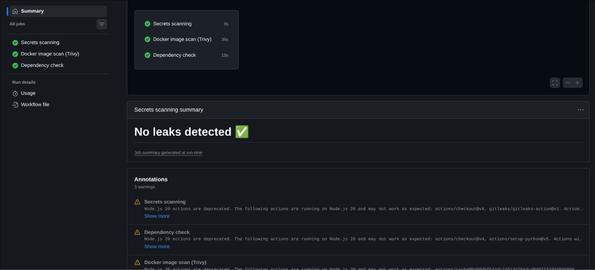
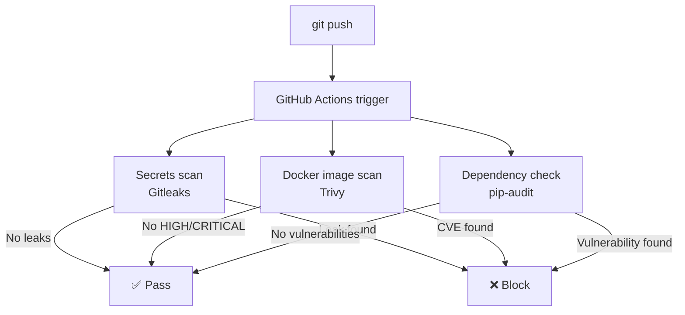

# 🔒 DevSecOps Pipeline

> Automated security pipeline with secrets scanning, Docker image vulnerability analysis and dependency auditing — running on GitHub Actions.


---

## Overview

**DevSecOps Pipeline** implements a security-first CI/CD workflow that automatically scans every push to the repository for secrets, container vulnerabilities and dependency issues — blocking insecure code before it reaches production.

The pipeline runs three security jobs in parallel on every `push` and `pull_request` to `main`:

| Job | Tool | What it checks |
|-----|------|----------------|
| Secrets scanning | Gitleaks | Tokens, API keys, passwords accidentally committed |
| Docker image scan | Trivy | CVEs in base image and Python packages |
| Dependency check | pip-audit | Known vulnerabilities in Python dependencies |

---

## Screenshot

### All three security jobs passing


---

## Architecture



---

## Security tools

### Gitleaks
Scans the full Git history (`fetch-depth: 0`) for hardcoded secrets. Checking only the latest commit would miss secrets introduced in earlier commits and later "deleted" — Git history is permanent.

### Trivy
Inspects the Docker image layer by layer against the NVD (National Vulnerability Database) and other sources. Detects CVEs in:
- The base OS image (Alpine Linux packages)
- Python packages installed via pip

### pip-audit
Audits Python dependencies declared in `requirements.txt` against the Python Packaging Advisory Database (PyPA). Complements Trivy with Python-ecosystem-specific vulnerability intelligence.

---

## Vulnerability remediation log

This project intentionally documents the full remediation cycle as it happened:

| CVE | Package | Action |
|-----|---------|--------|
| CVE-2026-27205 | flask 3.0.3 | Updated to 3.1.3 |
| CVE-2024-47081 | requests 2.32.3 | Updated to 2.33.0 |
| CVE-2026-25645 | requests 2.32.3 | Updated to 2.33.0 |
| CVE-2026-22184 | zlib (Alpine) | Accepted — untgz utility not used by application |
| CVE-2026-23949 | jaraco.context (pip internal) | Accepted — pip build dependency, not deployed |
| CVE-2026-24049 | wheel (pip internal) | Accepted — pip build dependency, not deployed |

Accepted risks are documented in `.trivyignore` with justification — following standard vulnerability management practices.

---

## Project structure

```
devsecops-pipeline/
├── .github/
│   └── workflows/
│       └── security.yml    # CI/CD pipeline definition
├── .trivyignore            # documented accepted CVEs with justification
├── Dockerfile              # Alpine-based container (minimal attack surface)
├── requirements.txt        # pinned dependencies at patched versions
├── app.py                  # sample Flask application
└── README.md
```

---

## Setup

### Run locally

```bash
# Build the image
docker build -t devsecops-demo .

# Run Trivy locally
docker run --rm \
  -v /var/run/docker.sock:/var/run/docker.sock \
  aquasec/trivy image devsecops-demo

# Run pip-audit locally
pip install pip-audit
pip-audit -r requirements.txt

# Run Gitleaks locally
docker run --rm \
  -v $(pwd):/path \
  zricethezav/gitleaks detect --source /path
```

### Fork and use in your own project

1. Fork this repository
2. Replace `app.py`, `requirements.txt` and `Dockerfile` with your own application
3. The pipeline runs automatically on every push — no additional configuration needed

---

## Key decisions

**Why Alpine instead of Debian?**
Alpine Linux has a significantly smaller attack surface — fewer pre-installed packages means fewer potential vulnerabilities. The Debian-based `python:3.11-slim` image had 6 HIGH CVEs with no available fix at scan time. Switching to `python:3.11-alpine` reduced this to 1, which was subsequently documented in `.trivyignore`.

**Why `fetch-depth: 0` in the Gitleaks step?**
Gitleaks needs the full Git history to detect secrets that were committed and later "removed". A shallow clone would only check the latest commit, missing historical leaks.

**Why document accepted risks instead of just ignoring them?**
Security is about risk management, not zero tolerance. The `.trivyignore` file documents which CVEs were analyzed, why they are not exploitable in this context, and who accepted the risk. This is standard practice in enterprise security teams.

---

## Skills Demonstrated

- CI/CD pipeline design with GitHub Actions (parallel jobs, triggers, environment variables)
- Container security — Docker image scanning with Trivy, CVE triage and remediation
- Secrets management — preventing credential leaks with Gitleaks
- Dependency security — Python package auditing with pip-audit
- Vulnerability management — risk assessment, remediation vs. acceptance decisions, documentation
- DevSecOps principles — shifting security left in the development lifecycle

---

## Related Projects

This project is part of a homelab cybersecurity portfolio built in preparation for the **MS Cybersécurité des Infrastructures et des Données** at Télécom SudParis.

Other projects in the series:
- [x] Network Watcher — real-time device detection with Telegram alerts
- [x] Network Dashboard — Grafana + Prometheus monitoring stack
- [x] Secure DNS — Pi-hole with query logging and malware blocking
- [x] DevSecOps Pipeline — automated security scanning with GitHub Actions
- [ ] Firewall — nftables with allowlists and block logging (in progress)
- [ ] IDS — Suricata with port scan detection
- [ ] SIEM — Wazuh for centralized log analysis
- [ ] Honeypot — Cowrie SSH trap
- [ ] AWS IAM lab — least privilege and role management
- [ ] AWS GuardDuty — cloud threat detection

---

## License

MIT
